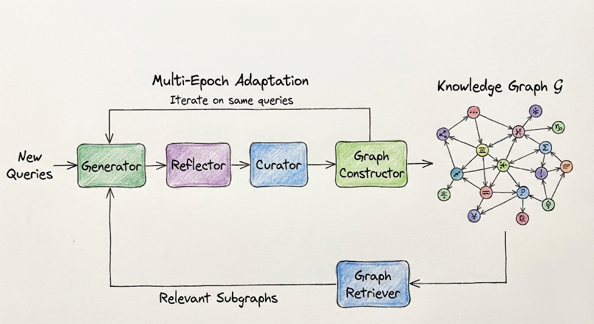

# GSAM: Graph-Structured Adaptive Memory for Agentic Context Engineering

<div align="left">



</div>

---

## Overview

**GSAM (Graph-Structured Adaptive Memory)** extends the [ACE (Agentic Context Engineering)](https://arxiv.org/abs/2510.04618) framework by replacing its flat bullet-point playbook with an **ontology-grounded knowledge graph**. Where ACE stores strategies as an unstructured list of text bullets, GSAM organizes knowledge into **typed nodes** (Strategy, AntiPattern, Concept, Formula, Confusion) connected by **typed edges** (is_a, applies_to, fails_for, fixes, confused_with, etc.), enabling:

- **Ontology-aware retrieval**: Query-time subgraph extraction via concept matching + BFS traversal, so only structurally relevant strategies are surfaced
- **Failure cascade warnings**: When an anti-pattern targets a concept that a formula depends on, GSAM warns the generator that the formula result will also be wrong
- **Cross-concept transfer**: Strategies learned for one XBRL entity type (e.g., `Revenues`) are automatically proposed as tentative candidates for its taxonomy siblings (e.g., `RevenueFromContractWithCustomerExcludingAssessedTax`)
- **Concept confusion tracking**: Explicit Confusion nodes document commonly confused entity pairs with distinguishing criteria

GSAM is evaluated on the **FiNER** (financial named entity recognition in XBRL) and **XBRL Formula** tasks from the ACE paper, with a new **FiNER-Transfer** benchmark that tests cross-concept transfer.

---

## Table of Contents

1. [Repository Structure](#repository-structure)
2. [Installation](#installation)
   - [Dependencies](#1-clone-and-install-dependencies)
   - [API Keys — Cloud Providers](#2a-option-a-cloud-providers-sambanova--together--openai)
   - [API Keys — Self-hosted DeepSeek on Modal](#2b-option-b-self-hosted-deepseek-on-modalcom)
3. [Running Experiments — In Order](#running-experiments--in-order)
   - [Step 1: ACE Baseline](#step-1-ace-baseline)
   - [Step 2: GSAM Experiments](#step-2-gsam-experiments)
   - [Step 3: GSAM Ablations](#step-3-gsam-ablations)
   - [Step 4: Build FiNER-Transfer Dataset](#step-4-build-finer-transfer-dataset)
   - [Step 5: Run Transfer Experiments](#step-5-run-transfer-experiments)
4. [Reading Your Results](#reading-your-results)
5. [How GSAM Works](#how-gsam-works)
6. [Output Structure](#output-structure)
7. [CLI Reference](#cli-reference)
8. [Tests](#tests)
9. [Citation](#citation)

---

## Repository Structure

```
gsam/
├── gsam/                              # GSAM extension module
│   ├── __init__.py
│   ├── graph_memory.py                # KnowledgeGraph: typed nodes/edges via NetworkX
│   ├── gsam.py                        # GSAM orchestrator (extends ACE architecture)
│   ├── ontology.py                    # XBRL taxonomy parser -> Concept nodes + is_a edges
│   ├── metrics.py                     # RFR, retrieval precision, concept coverage, transfer
│   ├── core/
│   │   ├── graph_constructor.py       # Curator deltas -> typed graph operations
│   │   └── graph_retriever.py         # 3-stage ontology-aware subgraph retrieval
│   └── prompts/
│       ├── generator.py               # Generator prompt consuming serialized subgraphs
│       ├── reflector.py               # Reflector prompt with concept-level error analysis
│       ├── curator.py                 # Curator prompt outputting graph operations
│       └── graph_constructor.py       # Fallback entity/relationship extraction prompt
│
├── ace/                               # Original ACE framework (baseline)
│   ├── ace.py                         # ACE orchestrator
│   ├── core/                          # Generator, Reflector, Curator agents
│   └── prompts/                       # ACE prompt templates
│
├── eval/finance/                      # Financial domain evaluation
│   ├── data_processor.py              # FiNER + Formula data preprocessing and scoring
│   ├── run.py                         # ACE entry point (baseline)
│   ├── run_gsam.py                    # GSAM entry point
│   ├── finer_transfer.py              # FiNER-Transfer benchmark builder
│   └── data/
│       ├── sample_config.json         # Data paths for finer and formula tasks
│       ├── xbrl_taxonomy.json         # US-GAAP taxonomy (139 entities, 9 categories)
│       ├── finer_train_batched_1000_samples.jsonl
│       ├── finer_val_batched_500_samples.jsonl
│       ├── finer_test_subset_006_seed42.jsonl
│       ├── formula_train_subset_500.jsonl
│       ├── formula_val_subset_300.jsonl
│       ├── formula_test.jsonl
│       └── finer_transfer/            # Generated transfer experiment splits
│
├── experiments/
│   ├── run_experiment.py              # Experiment runner (single or suite)
│   └── configs/                       # JSON experiment configs
│       ├── ace_finer_offline.json
│       ├── ace_finer_online.json
│       ├── ace_formula_offline.json
│       ├── ace_formula_online.json
│       ├── gsam_finer_offline.json
│       ├── gsam_finer_online.json
│       ├── gsam_formula_offline.json
│       ├── gsam_formula_online.json
│       ├── gsam_ablation_no_ontology.json
│       ├── gsam_ablation_no_cascades.json
│       ├── gsam_ablation_embedding_only.json
│       ├── gsam_ablation_untyped_edges.json
│       └── gsam_ablation_no_multiepoch.json
│
├── tests/                             # Unit tests (57 tests)
│   ├── test_graph_memory.py
│   ├── test_metrics.py
│   └── test_ontology.py
│
├── modal_serve.py                     # Self-hosted DeepSeek via vLLM on Modal.com
├── analyze_results.py                 # Print all paper tables and metrics from results/
├── llm.py                             # LLM call utilities with retry/error handling
├── logger.py                          # Logging utilities
├── utils.py                           # Shared utilities (evaluate_test_set, extract_answer)
├── playbook_utils.py                  # ACE playbook operations
├── requirements.txt                   # Python dependencies
├── .env.example                       # Template for .env configuration
└── EXTENDING_ACE.md                   # Guide for adding new tasks to ACE
```

---

## Installation

### 1. Clone and install dependencies

```bash
git clone https://github.com/purelyricky/gsam.git
cd gsam
pip install -r requirements.txt
```

The key dependencies are:

| Package | Purpose |
|---------|---------|
| `networkx>=3.0` | Knowledge graph storage and traversal |
| `numpy>=1.24.0` | Embedding computations |
| `sentence-transformers>=2.2.0` | Node embedding similarity for deduplication and retrieval |
| `openai>=1.0.0` | LLM API client (works with SambaNova, Together, OpenAI, Modal) |
| `tiktoken` | Token counting for budget management |
| `modal>=0.73.148` | Modal deployment SDK (only needed if self-hosting) |

> **Note on HuggingFace**: `sentence-transformers` automatically downloads `all-MiniLM-L6-v2` on first use. This model is public — no HuggingFace token is required for local runs.

### 2a. Option A: Cloud Providers (SambaNova / Together / OpenAI)

Copy `.env.example` to `.env` and fill in your key:

```bash
cp .env.example .env
```

```bash
# .env — pick one provider and fill it in
SAMBANOVA_API_KEY=your_sambanova_key   # default provider
TOGETHER_API_KEY=your_together_key
OPENAI_API_KEY=your_openai_key
```

### 2b. Option B: Self-hosted DeepSeek on Modal.com

Run your own OpenAI-compatible DeepSeek endpoint on GPU hardware for a flat per-hour cost (no per-token pricing).

**One-time setup:**

```bash
# 1. Install and authenticate Modal
pip install modal
modal setup        # opens browser — one-time login

# 2. Deploy the vLLM server
modal deploy modal_serve.py
#    CLI prints something like:
#    App deployed. URL: https://YOUR_WORKSPACE--gsam-deepseek-serve.modal.run
```

**Configure your `.env`:**

```bash
MODAL_API_URL=https://YOUR_WORKSPACE--gsam-deepseek-serve.modal.run/v1
# MODAL_API_KEY is optional — vLLM accepts any non-empty string
# MODAL_API_KEY=modal-key
```

**Verify the deployment:**

```bash
modal run modal_serve.py
# Prints the endpoint URL, runs a health check, and sends a test message
```

**Cost and model options** (edit `MODEL_NAME` and `N_GPU` at the top of `modal_serve.py`):

| Model | N_GPU | Approx. cost | Notes |
|-------|-------|-------------|-------|
| `deepseek-ai/DeepSeek-R1-Distill-Qwen-32B` | 2 × H100 | ~$8/hr | Default — good quality, practical |
| `deepseek-ai/DeepSeek-R1-Distill-Llama-70B` | 4 × H100 | ~$16/hr | Closer to V3 quality |
| `deepseek-ai/DeepSeek-V3-0324` | 8 × H100 | ~$32/hr | Matches ACE paper exactly |

The server stays warm for up to 20 minutes between requests (Modal's maximum; configurable via `scaledown_window` in `modal_serve.py`) to avoid cold-start delays mid-experiment.

**Running experiments with Modal:**

```bash
python -m eval.finance.run_gsam \
    --task_name finer \
    --mode online \
    --save_path results/gsam_finer_online \
    --api_provider modal \
    --generator_model "deepseek-ai/DeepSeek-R1-Distill-Qwen-32B" \
    --reflector_model "deepseek-ai/DeepSeek-R1-Distill-Qwen-32B" \
    --curator_model "deepseek-ai/DeepSeek-R1-Distill-Qwen-32B"
```

> Pass the exact `MODEL_NAME` from `modal_serve.py` as `--generator_model` / `--reflector_model` / `--curator_model`.

### 3. Verify installation

```bash
python -m unittest tests.test_graph_memory tests.test_metrics tests.test_ontology -v
```

All 57 tests should pass.

---

## Running Experiments — In Order

Run experiments in this order to reproduce the paper results. Each step builds on the previous one.

> **Smoke test first**: Add `--max_samples 10` to any command below to verify the pipeline end-to-end in under a minute before committing to a full run.

---

### Step 1: ACE Baseline

Run the ACE baseline to establish the comparison point. Results go into `results/ace_*/`.

**FiNER — offline (trains on train split, evaluates on test split):**

```bash
python -m eval.finance.run \
    --task_name finer \
    --mode offline \
    --num_epochs 5 \
    --save_path results/ace_finer_offline \
    --api_provider sambanova \
    --generator_model DeepSeek-V3.1 \
    --reflector_model DeepSeek-V3.1 \
    --curator_model DeepSeek-V3.1
```

**FiNER — online (trains and tests on test split in one pass):**

```bash
python -m eval.finance.run \
    --task_name finer \
    --mode online \
    --save_path results/ace_finer_online \
    --api_provider sambanova \
    --generator_model DeepSeek-V3.1
```

**Formula — online:**

```bash
python -m eval.finance.run \
    --task_name formula \
    --mode online \
    --save_path results/ace_formula_online \
    --api_provider sambanova \
    --generator_model DeepSeek-V3.1
```

**Formula — offline (5 epochs):**

```bash
python -m eval.finance.run \
    --task_name formula \
    --mode offline \
    --num_epochs 5 \
    --save_path results/ace_formula_offline \
    --api_provider sambanova \
    --generator_model DeepSeek-V3.1
```

**Where to find ACE results:** `results/ace_finer_online/ace_run_*/final_results.json` → key: `"accuracy"` (top-level)

---

### Step 2: GSAM Experiments

Run the full GSAM system on both tasks and both modes.

**FiNER — online:**

```bash
python -m eval.finance.run_gsam \
    --task_name finer \
    --mode online \
    --save_path results/gsam_finer_online \
    --api_provider sambanova \
    --generator_model DeepSeek-V3.1 \
    --taxonomy_path ./eval/finance/data/xbrl_taxonomy.json
```

**FiNER — offline (5 epochs per paper §6.4):**

```bash
python -m eval.finance.run_gsam \
    --task_name finer \
    --mode offline \
    --num_epochs 5 \
    --save_path results/gsam_finer_offline \
    --api_provider sambanova \
    --generator_model DeepSeek-V3.1 \
    --taxonomy_path ./eval/finance/data/xbrl_taxonomy.json
```

**Formula — online:**

```bash
python -m eval.finance.run_gsam \
    --task_name formula \
    --mode online \
    --save_path results/gsam_formula_online \
    --api_provider sambanova \
    --generator_model DeepSeek-V3.1 \
    --taxonomy_path ./eval/finance/data/xbrl_taxonomy.json
```

**Formula — offline (5 epochs per paper §6.4):**

```bash
python -m eval.finance.run_gsam \
    --task_name formula \
    --mode offline \
    --num_epochs 5 \
    --save_path results/gsam_formula_offline \
    --api_provider sambanova \
    --generator_model DeepSeek-V3.1 \
    --taxonomy_path ./eval/finance/data/xbrl_taxonomy.json
```

Alternatively, run all GSAM experiments via the experiment runner:

```bash
python -m experiments.run_experiment \
    --config_dir experiments/configs/ \
    --save_path results \
    --filter gsam_finer
```

**Where to find GSAM results:** `results/gsam_finer_online/gsam_run_*/final_results.json`
- Online mode: `result["online_test_results"]["accuracy"]`
- Offline mode: `result["final_test_results"]["accuracy"]`

---

### Step 3: GSAM Ablations

Each ablation removes one component to measure its contribution.

```bash
# No ontology initialization
python -m eval.finance.run_gsam \
    --task_name finer --mode online \
    --save_path results/ablation_no_ontology \
    --api_provider sambanova \
    --no_ontology

# No failure cascades (no AntiPattern nodes)
python -m eval.finance.run_gsam \
    --task_name finer --mode online \
    --save_path results/ablation_no_cascades \
    --api_provider sambanova \
    --no_failure_cascades

# Embedding-only retrieval (no graph BFS)
python -m eval.finance.run_gsam \
    --task_name finer --mode online \
    --save_path results/ablation_embedding_only \
    --api_provider sambanova \
    --embedding_only_retrieval

# Untyped edges
python -m eval.finance.run_gsam \
    --task_name finer --mode online \
    --save_path results/ablation_untyped_edges \
    --api_provider sambanova \
    --untyped_edges

# No multi-epoch graph refinement (single pass; compare to offline 5-epoch)
python -m eval.finance.run_gsam \
    --task_name finer --mode offline \
    --num_epochs 1 \
    --save_path results/ablation_no_multiepoch \
    --api_provider sambanova \
    --no_multi_epoch_refinement \
    --taxonomy_path ./eval/finance/data/xbrl_taxonomy.json
```

Or run all at once:

```bash
python -m experiments.run_experiment \
    --config_dir experiments/configs/ \
    --save_path results \
    --filter ablation
```

**Where to find ablation results:** `results/ablation_*/gsam_run_*/final_results.json` → `result["online_test_results"]["accuracy"]`, plus `rfr_metrics` from the metrics module (see [Reading Your Results](#reading-your-results) below).

---

### Step 4: Build FiNER-Transfer Dataset

Run this **once** to generate the transfer experiment splits. It reads the FiNER training data and the XBRL taxonomy to create sibling and distant concept pairs.

```bash
python -m eval.finance.finer_transfer \
    --taxonomy_path ./eval/finance/data/xbrl_taxonomy.json \
    --finer_data_path ./eval/finance/data/finer_train_batched_1000_samples.jsonl \
    --output_dir ./eval/finance/data/finer_transfer
```

This produces:
- `eval/finance/data/finer_transfer/concept_pairs.json` — all sibling pairs (same subcategory) and distant pairs (different categories)
- `eval/finance/data/finer_transfer/transfer_experiments.json` — experiment configs with source/target sample counts

**Verify it worked:**

```python
import json
pairs = json.load(open("eval/finance/data/finer_transfer/concept_pairs.json"))
print(f"Sibling pairs: {len([p for p in pairs if p['pair_type'] == 'sibling'])}")
print(f"Distant pairs: {len([p for p in pairs if p['pair_type'] == 'distant'])}")
```

---

### Step 5: Run Transfer Experiments

After building the dataset (Step 4), run the transfer protocol: for each concept pair (A → B), evaluate on B with no adaptation, adapt on A, then re-evaluate on B.

```python
import os, json
from eval.finance.finer_transfer import (
    load_taxonomy, build_concept_pairs, build_transfer_splits,
    evaluate_transfer, compute_aggregate_transfer_metrics,
)
from eval.finance.data_processor import DataProcessor
from gsam import GSAM

# Rebuild the transfer splits from saved pairs + original data
# (transfer_experiments.json only stores metadata; the examples come from finer data)
taxonomy = load_taxonomy("./eval/finance/data/xbrl_taxonomy.json")
pairs = json.load(open("eval/finance/data/finer_transfer/concept_pairs.json"))

processor = DataProcessor(task_name="finer")
finer_data = []
with open("./eval/finance/data/finer_train_batched_1000_samples.jsonl") as f:
    for line in f:
        if line.strip():
            finer_data.append(json.loads(line))
finer_data = processor.process_task_data(finer_data)

experiments = build_transfer_splits(finer_data, pairs)

# Initialize GSAM
gsam = GSAM(
    api_provider="sambanova",
    generator_model="DeepSeek-V3.1",
    reflector_model="DeepSeek-V3.1",
    curator_model="DeepSeek-V3.1",
    taxonomy_path="./eval/finance/data/xbrl_taxonomy.json",
)

config = {
    'max_num_rounds': 3,
    'curator_frequency': 1,
    'playbook_token_budget': 80000,
}

os.makedirs("results/transfer", exist_ok=True)

# Run all transfer experiments
results = []
for experiment in experiments:
    result = evaluate_transfer(
        method_name="gsam",
        experiment=experiment,
        system=gsam,
        data_processor=processor,
        config=config,
        save_path="results/transfer",
    )
    results.append(result)

# Aggregate and save
agg = compute_aggregate_transfer_metrics(results)
print(f"Near-transfer rate:     {agg['near_transfer_rate']:.2%}")
print(f"Far-transfer rate:      {agg['far_transfer_rate']:.2%}")
print(f"Negative transfer rate: {agg['negative_transfer_rate']:.2%}")

json.dump(agg, open("results/transfer/aggregate_metrics.json", "w"), indent=2)
```

**Where to find transfer results:** `results/transfer/aggregate_metrics.json` → keys: `near_transfer_rate`, `far_transfer_rate`, `negative_transfer_rate`

---

## Reading Your Results

After running experiments, get a full summary of all tables and metrics in one command:

```bash
python analyze_results.py                          # reads ./results/
python analyze_results.py --results_dir my/path    # custom directory
```

This prints all five tables needed for the paper (main accuracy, online vs. offline, ablations, graph growth, transfer metrics) and maps each metric to the hypothesis it supports.

For manual inspection, every metric and its exact file location is documented below:

### Accuracy (main result)

```python
import json

# ACE baseline accuracy (top-level key)
ace = json.load(open("results/ace_finer_online/ace_run_TIMESTAMP_finer_online/final_results.json"))
print(f"ACE accuracy: {ace['accuracy']:.3f}")

# GSAM accuracy — nested under mode-specific key
gsam = json.load(open("results/gsam_finer_online/gsam_run_TIMESTAMP_finer_online/final_results.json"))
# Online mode:
print(f"GSAM accuracy (online): {gsam['online_test_results']['accuracy']:.3f}")
# Offline mode:
# print(f"GSAM accuracy (offline): {gsam['final_test_results']['accuracy']:.3f}")
# Also available per mode: gsam['online_test_results']['correct'], gsam['online_test_results']['total']
```

Files: `{save_path}/gsam_run_*/final_results.json`

---

### Repeated Failure Rate (RFR)

Measures how often the same conceptual error recurs. Lower is better.

```python
from gsam.metrics import aggregate_experiment_results

summary = aggregate_experiment_results(
    "results/gsam_finer_online/gsam_run_TIMESTAMP_finer_online/"
)
rfr = summary["rfr_metrics"]
print(f"RFR: {rfr['rfr']:.3f}")
print(f"  Repeated errors: {rfr['repeated_errors']}")
print(f"  Total errors:    {rfr['total_errors']}")
```

Source file: `{save_path}/gsam_run_*/error_tracking.jsonl` (raw per-error data)

---

### Retrieval Precision

Fraction of retrieved graph nodes actually referenced by the generator. Higher means retrieval is focused and relevant.

```python
summary = aggregate_experiment_results(
    "results/gsam_finer_online/gsam_run_TIMESTAMP_finer_online/"
)
ret = summary["retrieval_metrics"]
print(f"Mean retrieval precision: {ret['mean_precision']:.3f}")
print(f"Mean retrieval time:      {ret['mean_retrieval_time_s']:.3f}s")
```

Source file: `{save_path}/gsam_run_*/retrieval_logs.jsonl` (raw per-query data)

---

### Concept Coverage

Fraction of the 139 XBRL entity types that have at least one learned Strategy or AntiPattern.

```python
summary = aggregate_experiment_results(
    "results/gsam_finer_online/gsam_run_TIMESTAMP_finer_online/"
)
print(f"Concept coverage: {summary['concept_coverage']:.2%}")
```

Source file: `{save_path}/gsam_run_*/graph_stats.json` → key: `concept_coverage`

---

### Graph Growth

How the knowledge graph evolved over training:

```python
import json

stats = json.load(open(
    "results/gsam_finer_online/gsam_run_TIMESTAMP_finer_online/graph_stats.json"
))
print(f"Total nodes:   {stats['total_nodes']}")
print(f"Total edges:   {stats['total_edges']}")
print(f"Strategies:    {stats['node_counts'].get('Strategy', 0)}")
print(f"AntiPatterns:  {stats['node_counts'].get('AntiPattern', 0)}")
print(f"Confusions:    {stats['node_counts'].get('Confusion', 0)}")
```

---

### Transfer Metrics (FiNER-Transfer benchmark)

```python
import json

agg = json.load(open("results/transfer/aggregate_metrics.json"))
print(f"Near-transfer rate:     {agg['near_transfer_rate']:.2%}")   # sibling pairs
print(f"Far-transfer rate:      {agg['far_transfer_rate']:.2%}")    # distant pairs
print(f"Negative transfer rate: {agg['negative_transfer_rate']:.2%}")
```

Per-experiment raw data: `results/transfer/{pair_name}.json` → keys: `baseline_acc`, `transfer_acc`, `delta_transfer`

---

### Ablation Comparison Table

To reproduce the ablation table from the paper, collect accuracy from each ablation run:

```python
import json, glob, os

runs = {
    "Full GSAM":           "results/gsam_finer_online",
    "No ontology":         "results/ablation_no_ontology",
    "No cascades":         "results/ablation_no_cascades",
    "Embedding only":      "results/ablation_embedding_only",
    "Untyped edges":       "results/ablation_untyped_edges",
}

for name, path in runs.items():
    # Find the results file (timestamp varies)
    files = glob.glob(os.path.join(path, "*/final_results.json"))
    if files:
        r = json.load(open(files[0]))
        # GSAM online results are nested under 'online_test_results'
        acc = r.get("online_test_results", r).get("accuracy", 0)
        print(f"{name:25s}  accuracy={acc:.3f}")
```

---

## How GSAM Works

GSAM follows the same Generator-Reflector-Curator loop as ACE, but replaces the flat playbook with a knowledge graph:

### Training Loop (per sample)

```
1. RETRIEVE    Query text -> concept matching + BFS -> serialized subgraph
2. GENERATE    Subgraph context + question -> LLM -> predicted answer
3. REFLECT     Prediction vs. ground truth -> concept-level error analysis
4. CURATE      Reflection -> structured graph operations (ADD_STRATEGY, ADD_ANTIPATTERN, ADD_CONFUSION)
5. CONSTRUCT   Operations -> deduplicate -> apply to knowledge graph
6. PRUNE       Periodically remove low-utility nodes (never prune ontology backbone)
```

### Knowledge Graph Node Types

| Type | Prefix | Description |
|------|--------|-------------|
| **Concept** | `C:` | XBRL entity types from the taxonomy (e.g., `Revenues`, `NetIncomeLoss`) |
| **Strategy** | `S:` | Learned approaches that work (e.g., "Check for unrealized gains to distinguish NetIncome from ComprehensiveIncome") |
| **AntiPattern** | `A:` | Known failure modes to avoid (e.g., "Confusing gross revenue with net revenue") |
| **Formula** | `F:` | XBRL formula definitions with their input dependencies |
| **Confusion** | `X:` | Documented concept pairs that are commonly confused |

### Knowledge Graph Edge Types

| Edge | Direction | Meaning |
|------|-----------|---------|
| `is_a` | Entity -> Subcategory -> Category | Taxonomy hierarchy |
| `applies_to` | Strategy -> Concept | Strategy addresses this concept |
| `fails_for` | AntiPattern -> Concept | Anti-pattern causes errors for this concept |
| `fixes` | Strategy -> AntiPattern | Strategy resolves this anti-pattern |
| `depends_on` | Formula -> Concept | Formula requires this entity as input |
| `confused_with` | Concept <-> Concept | Bidirectional confusion link |
| `conflicts_with` | Strategy <-> Strategy | Mutually exclusive strategies |

### Three-Stage Retrieval

```
Stage 1: Concept Identification
  - Keyword matching: exact concept names found in query text
  - Embedding similarity: cosine similarity against all Concept node embeddings

Stage 2: Graph Traversal
  - BFS from matched concepts (default depth=2)
  - Collects connected Strategies, AntiPatterns, Formulas

Stage 3: Taxonomic Expansion
  - Walk is_a edges to find sibling concepts
  - Transfer strategies from siblings (marked as "tentative")
  - Include failure cascade warnings for formulas
```

---

## Output Structure

After a GSAM run, the following files are produced:

```
results/gsam_run_TIMESTAMP_finer_online/
├── run_config.json                     # Full configuration used for this run
├── final_results.json                  # Final accuracy: {"accuracy": 0.XX, "correct": N, "total": N}
├── initial_test_results.json           # Baseline accuracy with empty/ontology-only graph
├── test_results.json                   # Final accuracy after adaptation (same as final_results)
├── retrieval_logs.jsonl                # Per-query retrieval precision and timing
├── error_tracking.jsonl                # Per-error concept tracking (source for RFR)
├── graph_stats.json                    # Final graph statistics (node counts, edge counts, coverage)
├── detailed_llm_logs/                  # Raw LLM request/response logs per call
└── graph_checkpoints/
    ├── graph_step_0.json               # Initial graph (ontology-only backbone)
    ├── graph_step_50.json              # Checkpoint every --save_steps steps
    ├── graph_best.json                 # Best validation accuracy (offline mode only)
    └── graph_final.json                # Final evolved graph after training
```

### Inspecting a saved graph

```python
from gsam.graph_memory import KnowledgeGraph, NodeType

graph = KnowledgeGraph.load("results/gsam_run_TIMESTAMP/graph_checkpoints/graph_final.json")

print(graph)
# KnowledgeGraph(nodes=245, edges=412, concepts=139, coverage=0.67)

# List strategies
for nid in graph.get_nodes_by_type(NodeType.STRATEGY)[:5]:
    data = graph.graph.nodes[nid]
    print(f"[{nid}] helpful={data['helpful_count']} harmful={data['harmful_count']}")
    print(f"  {data['content'][:100]}")

# Save a copy
graph.save("my_graph.json")
```

---

## Programmatic Usage

```python
from gsam import GSAM
from eval.finance.data_processor import DataProcessor

gsam_system = GSAM(
    api_provider="sambanova",
    generator_model="DeepSeek-V3.1",
    reflector_model="DeepSeek-V3.1",
    curator_model="DeepSeek-V3.1",
    max_tokens=4096,
    taxonomy_path="./eval/finance/data/xbrl_taxonomy.json",
    merge_threshold=0.9,
    retrieval_depth=2,
    prune_frequency=50,
)

processor = DataProcessor(task_name="finer")

config = {
    'num_epochs': 1,
    'max_num_rounds': 3,
    'curator_frequency': 1,
    'eval_steps': 100,
    'online_eval_frequency': 15,
    'save_steps': 50,
    'playbook_token_budget': 80000,
    'task_name': 'finer',
    'mode': 'online',
    'json_mode': False,
    'no_ground_truth': False,
    'save_dir': './results',
    'test_workers': 20,
}

results = gsam_system.run(
    mode='online',
    test_samples=test_data,
    data_processor=processor,
    config=config,
)

stats = gsam_system.knowledge_graph.stats()
print(f"Strategies: {stats['node_counts'].get('Strategy', 0)}")
print(f"Concept coverage: {stats['concept_coverage']:.2%}")
```

---

## CLI Reference

### `eval.finance.run_gsam` — Full argument list

<details>
<summary>Click to expand</summary>

| Argument | Description | Default |
|----------|-------------|---------|
| `--task_name` | Task name (`finer` or `formula`) | Required |
| `--mode` | `offline`, `online`, or `eval_only` | `offline` |
| `--save_path` | Directory to save results | Required |
| `--api_provider` | `sambanova`, `together`, `openai`, or `modal` | `sambanova` |
| `--generator_model` | Model for the generator agent | `DeepSeek-V3.1` |
| `--reflector_model` | Model for the reflector agent | `DeepSeek-V3.1` |
| `--curator_model` | Model for the curator agent | `DeepSeek-V3.1` |
| `--num_epochs` | Training epochs (offline only) | `5` |
| `--max_num_rounds` | Max reflection rounds per incorrect answer | `3` |
| `--curator_frequency` | Run curator every N training steps | `1` |
| `--eval_steps` | Evaluate on validation set every N steps | `100` |
| `--online_eval_frequency` | Window size for online test-then-train | `15` |
| `--save_steps` | Save graph checkpoint every N steps | `50` |
| `--max_tokens` | Max tokens per LLM call | `4096` |
| `--playbook_token_budget` | Token budget for graph serialization | `80000` |
| `--test_workers` | Parallel workers for test evaluation | `20` |
| `--json_mode` | Enable JSON mode for LLM calls | `False` |
| `--no_ground_truth` | Omit ground truth from reflector | `False` |
| `--taxonomy_path` | Path to XBRL taxonomy JSON | `./eval/finance/data/xbrl_taxonomy.json` |
| `--merge_threshold` | Cosine similarity for node deduplication | `0.9` |
| `--retrieval_depth` | BFS depth for graph retrieval | `2` |
| `--prune_frequency` | Prune low-utility nodes every N steps | `50` |
| `--no_ontology` | Skip XBRL taxonomy initialization | `False` |
| `--no_failure_cascades` | Skip anti-pattern and failure edge creation | `False` |
| `--embedding_only_retrieval` | Use embedding similarity only (no graph BFS) | `False` |
| `--untyped_edges` | All edges become generic `related_to` | `False` |
| `--max_samples` | Limit samples for smoke testing | `None` |

</details>

### `eval.finance.run` (ACE baseline) — Key differences

- No `--taxonomy_path`, `--merge_threshold`, `--retrieval_depth`, `--prune_frequency`, or ablation flags
- Has `--use_bulletpoint_analyzer` and `--bulletpoint_analyzer_threshold` instead
- Default `--num_epochs` is `1` (vs. `5` for GSAM)

---

## Tests

```bash
python -m unittest tests.test_graph_memory tests.test_metrics tests.test_ontology -v
```

The tests cover:

- **test_graph_memory.py** (36 tests): Node/edge CRUD, auto-ID generation, node merging, subgraph extraction, neighbor filtering, taxonomy helpers (ancestors, children, siblings, LCA), serialization/deserialization, pruning rules, graph statistics
- **test_metrics.py** (14 tests): RFR computation with repeated/unique/confusion-pair errors, retrieval precision aggregation, concept coverage, transfer metric computation (positive/negative/zero delta)
- **test_ontology.py** (7 tests): Taxonomy loading from JSON, category/subcategory/entity node creation, is_a edge structure, taxonomy path attributes, sibling resolution, entity name mapping

---

## Citation

If you use GSAM or ACE in your research, please cite:

```bibtex
@misc{zhang2025agenticcontextengineeringevolving,
      title={Agentic Context Engineering: Evolving Contexts for Self-Improving Language Models},
      author={Qizheng Zhang and Changran Hu and Shubhangi Upasani and Boyuan Ma and Fenglu Hong and Vamsidhar Kamanuru and Jay Rainton and Chen Wu and Mengmeng Ji and Hanchen Li and Urmish Thakker and James Zou and Kunle Olukotun},
      year={2025},
      eprint={2510.04618},
      archivePrefix={arXiv},
      primaryClass={cs.LG},
      url={https://arxiv.org/abs/2510.04618},
}
```
